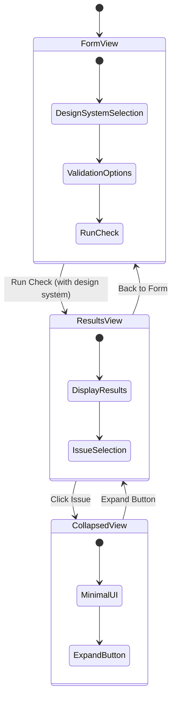
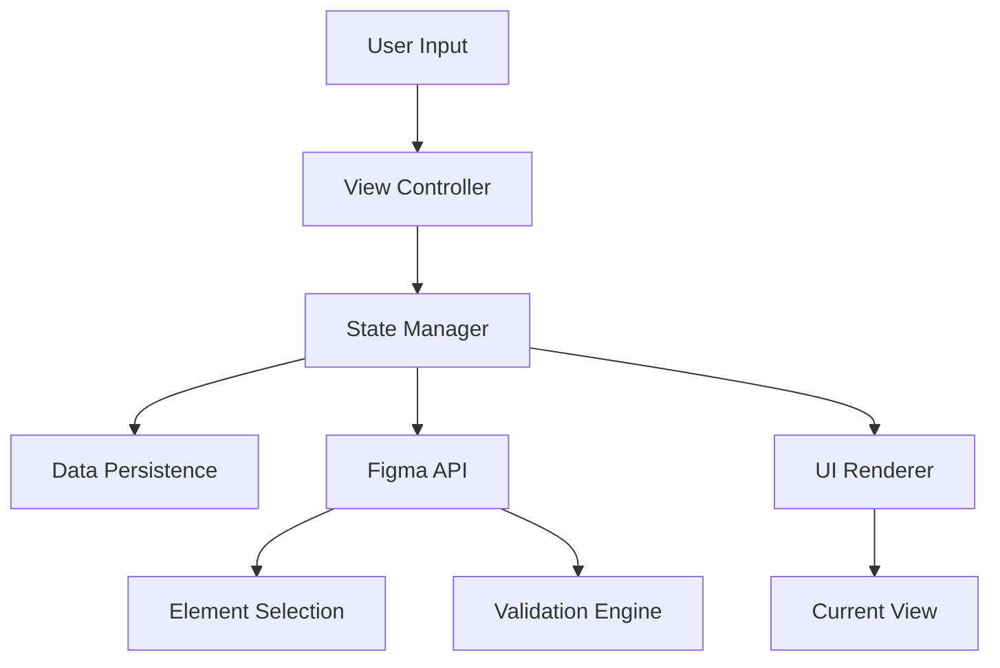

# Design Document

## Overview

The Token Validator will implement a three-view interface system that provides an intuitive workflow for design token validation. The system uses a state-based architecture where each view represents a distinct user interaction mode, with smooth transitions and persistent data management.

## Architecture

### View State Management

The application will use a centralized view state manager that controls:
- Current active view (form, results, collapsed)
- View transition animations
- Data persistence between views
- Window sizing and positioning



### Data Flow Architecture



## Components and Interfaces

### 1. View Controller

**Purpose:** Manages view transitions and coordinates between UI and business logic

**Key Methods:**
- `switchToView(viewType: ViewType, data?: any)`
- `preserveCurrentState()`
- `restorePreviousState()`

**Responsibilities:**
- Handle view transitions with animations
- Manage window resizing for different views
- Coordinate data flow between views

### 2. Form View Component

**Layout Structure:**
```
┌─────────────────────────────────────┐
│ Token Validation                    │
│                                     │
│ Design System: [Dropdown ▼]        │
│ ☐ Attach Design System              │
│                                     │
│ What to check:                      │
│ ☑ Spacings (padding, gaps)          │
│ ☐ Corner Radius                     │
│ ☐ Font Size                         │
│ ☐ Font Color                        │
│                                     │
│ [Run Check] (disabled if no DS)     │
└─────────────────────────────────────┘
```

**Key Features:**
- Design system dropdown with available libraries
- Visual attachment status indicator
- Validation option checkboxes with icons
- Conditional "Run Check" button state
- Form validation and error messaging

### 3. Results View Component

**Layout Structure:**
```
┌─────────────────────────────────────┐
│ ← Back to Form    Results           │
│                                     │
│ ⚠️ Issues Found                     │
│ 5 issues in 12 nodes (selection)   │
│                                     │
│ ┌─────────────────────────────────┐ │
│ │ 🟠 Button Component             │ │
│ │ Manual padding (left: 16px)     │ │
│ │ → Use spacing tokens            │ │
│ │ 👆 Click to select in Figma     │ │
│ └─────────────────────────────────┘ │
│ ┌─────────────────────────────────┐ │
│ │ 🔵 Card Container               │ │
│ │ Manual corner radius (8px)      │ │
│ │ → Use border-radius tokens      │ │
│ │ 👆 Click to select in Figma     │ │
│ └─────────────────────────────────┘ │
└─────────────────────────────────────┘
```

**Key Features:**
- Clear navigation back to form view
- Results summary with counts and scope
- Categorized issue list with color coding
- Clickable issue items for element selection
- Scrollable results area for large datasets

### 4. Collapsed View Component

**Layout Structure:**
```
┌─────────────────┐
│                 │
│ [Token Validator] │
│                 │
└─────────────────┘
```

**Key Features:**
- Minimal single-button interface
- Centered button with clear labeling
- Hover states and visual feedback
- Quick return to results view

### 5. State Management System

**ViewState Interface:**
```typescript
interface ViewState {
  currentView: 'form' | 'results' | 'collapsed';
  formData: {
    selectedDesignSystem: string | null;
    validationOptions: string[];
    attachedSystemInfo: DesignSystemInfo | null;
  };
  resultsData: {
    issues: ValidationIssue[];
    totalNodes: number;
    scope: string;
    timestamp: Date;
  } | null;
  previousView: 'form' | 'results' | null;
}
```

**Persistence Strategy:**
- Use Figma's `clientStorage` for design system selection
- Use session storage for validation options and results
- Implement automatic state saving on view transitions

## Data Models

### Design System Model
```typescript
interface DesignSystemInfo {
  id: string;
  name: string;
  type: 'local-variables' | 'library-variables' | 'local-styles';
  source: 'Local' | 'Library';
  assetsCount: number;
}
```

### Validation Issue Model
```typescript
interface ValidationIssue {
  nodeId: string;
  nodeName: string;
  type: 'spacing' | 'corner-radius' | 'font-size' | 'font-color';
  issue: string;
  suggestion: string;
  severity: 'warning' | 'error';
}
```

### View Transition Model
```typescript
interface ViewTransition {
  from: ViewType;
  to: ViewType;
  animation: 'slide' | 'fade' | 'resize';
  duration: number;
  preserveData: boolean;
}
```

## Error Handling

### Form View Error States
1. **No Design System Selected**
   - Disable "Run Check" button
   - Show helper text: "Please select a design system first"
   - Highlight design system section

2. **Design System Loading Failed**
   - Show error message in dropdown
   - Provide retry mechanism
   - Log detailed error information

3. **No Validation Options Selected**
   - Show warning message
   - Suggest selecting at least one option
   - Allow proceeding with warning

### Results View Error States
1. **Validation Failed**
   - Show error message instead of results
   - Provide "Try Again" button
   - Maintain form settings for retry

2. **No Issues Found**
   - Show success message with celebration
   - Provide clear "Run Another Check" option
   - Display validation summary

### Collapsed View Error States
1. **Element Not Found**
   - Show notification in Figma
   - Automatically return to results view
   - Highlight the problematic issue

## Testing Strategy

### Unit Testing
- **View Controller:** Test view transitions and state management
- **Form Validation:** Test design system selection and option validation
- **Results Processing:** Test issue categorization and display logic
- **State Persistence:** Test data saving and restoration

### Integration Testing
- **Figma API Integration:** Test design system loading and element selection
- **View Transitions:** Test complete user workflows
- **Error Scenarios:** Test error handling across all views
- **Performance:** Test with large datasets and complex designs

### User Experience Testing
- **Navigation Flow:** Test intuitive movement between views
- **Visual Feedback:** Test loading states and transitions
- **Accessibility:** Test keyboard navigation and screen reader support
- **Responsive Design:** Test different window sizes and zoom levels

### Test Scenarios
1. **Complete Workflow Test**
   - Load plugin → Select design system → Choose options → Run check → View results → Click issue → Return to results → Modify settings → Run again

2. **Error Recovery Test**
   - Trigger various error states and verify graceful recovery

3. **State Persistence Test**
   - Close and reopen plugin to verify settings are preserved

4. **Performance Test**
   - Test with large Figma files and multiple design systems

## Implementation Considerations

### Performance Optimization
- Lazy load design system data
- Implement virtual scrolling for large result sets
- Cache validation results for quick re-display
- Optimize view transition animations

### Accessibility
- Implement proper ARIA labels and roles
- Ensure keyboard navigation works across all views
- Provide screen reader announcements for view changes
- Maintain focus management during transitions

### Browser Compatibility
- Use modern CSS features with fallbacks
- Implement smooth animations with performance considerations
- Handle different viewport sizes gracefully

### Figma Plugin Constraints
- Work within Figma's iframe security model
- Handle plugin resize limitations
- Manage communication with Figma's main thread efficiently