<div align="center">

# 🎨 Figma Token Validator

**A powerful Figma plugin for design system compliance and token management**

[](https://www.figma.com)
[](https://www.typescriptlang.org/)
[](LICENSE)

*Maintain design system consistency by validating compliance and applying text styles and spacing tokens from external design system libraries.*

[Features](#-features) • [Installation](#-installation--setup) • [Usage](#-usage-guide) • [Contributing](#-contributing)

</div>

---

## ✨ Features

<table>
<tr>
<td width="50%">

### 🎯 **Design System Validation**
- ✅ **Text Style Validation** - Identifies text layers without applied text styles
- 📏 **Spacing Validation** - Detects hardcoded spacing values (padding, gaps)
- ⚡ **Real-time Results** - Instant validation feedback with detailed reporting
- 🔍 **Collapsed View** - Focus mode for individual asset validation

### 📚 **External Library Integration**
- 📤 **Library Export** - Export text styles and variables from any Figma file
- 🔗 **Cross-file Application** - Apply styles from external design system files
- 🎛️ **Variable Support** - Full support for Figma variables including spacing tokens
- 📋 **Multiple Libraries** - Manage and switch between multiple design systems

</td>
<td width="50%">

### 🔧 **Smart Application Tools**
- 🎯 **One-click Style Application** - Apply text styles directly to validation issues
- 📐 **Spacing Token Application** - Replace hardcoded spacing with design tokens
- ⚡ **Bulk Operations** - Apply styles to multiple text layers at once
- 🎪 **Node Selection** - Automatic node selection and highlighting

### 🎨 **Intuitive Interface**
- 🔄 **Multi-screen Workflow** - Guided process from export to validation
- 📱 **Responsive UI** - Adaptive interface that resizes based on current mode
- 📊 **Visual Feedback** - Clear indicators for validation status and progress
- 📦 **Collapsed Mode** - Minimized view for focused validation work

</td>
</tr>
</table>

## 🚀 How It Works

```mermaid
graph LR
    A[📁 Design System File] --> B[📤 Export Tokens]
    B --> C[💾 Save Library]
    C --> D[🎨 Design File]
    D --> E[🔍 Run Validation]
    E --> F[📋 Review Issues]
    F --> G[✅ Apply Fixes]
    G --> H[🎉 Compliant Design]
```

<div align="center">



</div>

### 1️⃣ **Export Design System**
```
🎨 Open design system file → 🚀 Launch plugin → 📤 Export keys → 💾 Save locally
```

### 2️⃣ **Validate Designs** 
```
📁 Open design file → 📚 Select library → ⚙️ Choose options → 🔍 Run validation
```

### 3️⃣ **Fix Issues**
```
📋 Review results → 🎯 Select fixes → ⚡ Apply updates → 👁️ Focus view
```

## 🛠️ Installation & Setup

### 📋 Prerequisites

<table>
<tr>
<td>

**Required:**
- [Node.js](https://nodejs.org/en/download/) (v14+)
- [Figma Desktop App](https://www.figma.com/downloads/)

</td>
<td>

**Optional:**
- TypeScript: `npm install -g typescript`
- VS Code for development

</td>
</tr>
</table>

### 🔧 Development Setup

```bash
# 1. Clone the repository
git clone https://github.com/PivensPortfolio/Figma-Token-Validator.git
cd Figma-Token-Validator

# 2. Install dependencies
npm install

# 3. Install Figma plugin types
npm install --save-dev @figma/plugin-typings

# 4. Build the plugin
npm run build

# 5. For development with auto-rebuild
npm run watch
```

### 🎨 Installing in Figma

<details>
<summary><strong>📱 Step-by-step installation</strong></summary>

1. **Open Figma Desktop App**
2. **Navigate to Plugins**
   ```
   Menu → Plugins → Development → Import plugin from manifest...
   ```
3. **Select manifest file**
   - Browse to your project folder
   - Select `manifest.json`
4. **Plugin ready!** 
   - Find "Token Validator" in your Plugins menu
   - Start using immediately

</details>

## 📖 Usage Guide

### 📤 **Exporting a Design System**

<details>
<summary><strong>Step-by-step export process</strong></summary>

1. **🎨 Open your design system file** in Figma
2. **🚀 Launch the plugin** from the Plugins menu  
3. **📤 Click "Export Keys"** - this will:
   - ✅ Extract all local text styles
   - ✅ Export all local variables (including spacing tokens)
   - ✅ Save the data with your file name as the library key
4. **🎉 Confirmation** - you'll see a success message with the count of exported items

> **💡 Pro Tip:** Export from your main design system file to ensure all teams use the same source of truth.

</details>

### 🔍 **Validating a Design File**

<details>
<summary><strong>Run validation on any design</strong></summary>

1. **📁 Open the file** you want to validate
2. **🚀 Launch the plugin** and select your exported design system library
3. **⚙️ Choose validation options**:
   - 📝 **Text Styles**: Find text without applied styles
   - 📏 **Spacing**: Find hardcoded padding and gaps
4. **⚡ Run validation** - results appear instantly
5. **📋 Review issues** in the detailed report

> **⚠️ Note:** Validation is optimized for files up to 1000 nodes for best performance.

</details>

### ✅ **Fixing Validation Issues**

<details>
<summary><strong>Apply fixes with one click</strong></summary>

1. **🎯 Select appropriate fixes** using the dropdown menus next to each issue
2. **⚡ Click "Update"** to apply the selected style or token
3. **👁️ Use "View" button** to switch to collapsed mode and focus on specific assets
4. **📊 Track progress** - fixed items are automatically removed from the list

> **🎪 Collapsed Mode Features:**
> - 🔄 **Automatic activation** when clicking "View" buttons
> - 🎯 **Focused validation** showing only issues for the selected asset
> - 📱 **Minimize/expand** toggle for switching between full and collapsed views
> - 🎪 **Selection tracking** automatically updates when you select different assets

</details>

## 🏗️ Technical Architecture

<details>
<summary><strong>🔧 Core Components</strong></summary>

| Component | Purpose | Technology |
|-----------|---------|------------|
| **`code.ts`** | Main plugin logic, Figma API interactions, validation engine | TypeScript |
| **`ui.html`** | Complete user interface with embedded CSS and JavaScript | HTML/CSS/JS |
| **`manifest.json`** | Plugin configuration and permissions | JSON |

</details>

<details>
<summary><strong>⚡ Key Features Implementation</strong></summary>

- **🔄 Duplicate Prevention**: Event handlers use `data-handlers-attached` attributes
- **💾 State Management**: Persistent storage for libraries and UI state  
- **🔍 Validation Engine**: Recursive node traversal with safety checks
- **🔗 Cross-file Integration**: Figma's `importStyleByKeyAsync` API for external styles

</details>

<details>
<summary><strong>📊 Data Structure</strong></summary>

```typescript
type SavedLibrary = {
  libraryName: string;
  libraryFileKey?: string | null;
  generatedAt: string;
  type: 'design-system-export';
  version: number;
  items: Record<string, string>; // Style name -> style key
  variables?: Record<string, any>; // Variable collections
};
```

</details>

## 📡 API Reference

<details>
<summary><strong>🔌 Plugin Messages</strong></summary>

| Message | Purpose |
|---------|---------|
| `export-keys` | Export design system from current file |
| `run-validation` | Validate current selection or page |
| `apply-text-style` | Apply text style to specific node |
| `apply-spacing-token` | Apply spacing token to specific node |
| `select-node` | Select and highlight specific node in Figma |

</details>

<details>
<summary><strong>💾 Storage</strong></summary>

| Key | Purpose |
|-----|---------|
| `savedLibraries` | Persistent storage for exported design systems |
| `status` | Current UI state and workflow position |

</details>

## 🤝 Contributing

We welcome contributions! Here's how to get started:

<details>
<summary><strong>🚀 Quick Start</strong></summary>

```bash
# 1. Fork the repository
# 2. Clone your fork
git clone https://github.com/YOUR_USERNAME/Figma-Token-Validator.git

# 3. Create a feature branch
git checkout -b feature/amazing-feature

# 4. Make your changes and test thoroughly
npm run build && npm test

# 5. Commit with descriptive messages
git commit -m "Add amazing feature"

# 6. Push to your fork and submit a pull request
git push origin feature/amazing-feature
```

</details>

<details>
<summary><strong>📋 Development Guidelines</strong></summary>

- ✅ Follow TypeScript best practices
- ✅ Maintain backward compatibility for saved libraries
- ✅ Test with multiple design system configurations
- ✅ Ensure UI responsiveness across different screen sizes
- ✅ Add tests for new features
- ✅ Update documentation as needed

</details>

## 🐛 Troubleshooting

<details>
<summary><strong>❓ Common Issues</strong></summary>

| Issue | Solution |
|-------|----------|
| **"No style map found"** | Ensure you've exported a design system library first |
| **"Style not found"** | The selected style may have been renamed or deleted in the source file |
| **Validation not working** | Check that you have proper selection or are on a valid page |
| **UI not responsive** | Try refreshing the plugin or restarting Figma |

</details>

<details>
<summary><strong>⚡ Performance Tips</strong></summary>

- 🎯 Validation is limited to 1000 nodes for optimal performance
- ⏱️ Large files may take longer to process
- 📦 Use collapsed mode for focused work on specific assets
- 🔄 Refresh the plugin if it becomes unresponsive

</details>

---

<div align="center">

## 📄 License

This project is open source under the [MIT License](LICENSE).

## 💬 Support & Community

<table>
<tr>
<td align="center">
<strong>🐛 Issues</strong><br>
<a href="https://github.com/PivensPortfolio/Figma-Token-Validator/issues">Report bugs</a>
</td>
<td align="center">
<strong>💡 Feature Requests</strong><br>
<a href="https://github.com/PivensPortfolio/Figma-Token-Validator/issues">Suggest features</a>
</td>
<td align="center">
<strong>❓ Questions</strong><br>
<a href="https://github.com/PivensPortfolio/Figma-Token-Validator/discussions">Ask questions</a>
</td>
</tr>
</table>

**When reporting issues, please include:**
- 📝 Steps to reproduce any bugs
- 📁 Sample files when possible
- 🖥️ Your Figma version and OS

---

<sub>Built with ❤️ for the design community</sub>

</div>
