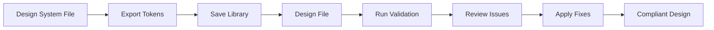

<div align="center">

# 🎨 Figma Token Validator

**A powerful Figma plugin for design system compliance and token management**

[](https://www.figma.com)
[](https://www.typescriptlang.org/)
[](LICENSE)

*Maintain design system consistency by validating compliance and applying text styles and spacing tokens from external design system libraries.*

[Features](#features) • [Installation](#installation--setup) • [Usage](#usage-guide) • [Contributing](#contributing)

</div>

---

## Features

<table>
<tr>
<td width="50%">

### **Design System Validation**
- **Text Style Validation** - Identifies text layers without applied text styles
- **Spacing Validation** - Detects hardcoded spacing values (padding, gaps)
- **Real-time Results** - Instant validation feedback with detailed reporting
- **Collapsed View** - Focus mode for individual asset validation

### **External Library Integration**
- **Library Export** - Export text styles and variables from any Figma file
- **Cross-file Application** - Apply styles from external design system files
- **Variable Support** - Full support for Figma variables including spacing tokens
- **Multiple Libraries** - Manage and switch between multiple design systems

</td>
<td width="50%">

### **Smart Application Tools**
- **One-click Style Application** - Apply text styles directly to validation issues
- **Spacing Token Application** - Replace hardcoded spacing with design tokens
- **Bulk Operations** - Apply styles to multiple text layers at once
- **Node Selection** - Automatic node selection and highlighting

### **Intuitive Interface**
- **Multi-screen Workflow** - Guided process from export to validation
- **Responsive UI** - Adaptive interface that resizes based on current mode
- **Visual Feedback** - Clear indicators for validation status and progress
- **Collapsed Mode** - Minimized view for focused validation work

</td>
</tr>
</table>

## How It Works

<div align="center">



</div>

### 1. **Export Design System**
```
Open design system file → Launch plugin → Export keys → Save locally
```

### 2. **Validate Designs** 
```
Open design file → Select library → Choose options → Run validation
```

### 3. **Fix Issues**
```
Review results → Select fixes → Apply updates → Focus view
```

## Installation & Setup

### Prerequisites

<table>
<tr>
<td>

**Required:**
- [Node.js](https://nodejs.org/en/download/) (v14+)
- [Figma Desktop App](https://www.figma.com/downloads/)

</td>
<td>

**Optional:**
- TypeScript: `npm install -g typescript`
- VS Code for development

</td>
</tr>
</table>

### Development Setup

```bash
# 1. Clone the repository
git clone https://github.com/PivensPortfolio/Figma-Token-Validator.git
cd Figma-Token-Validator

# 2. Install dependencies
npm install

# 3. Install Figma plugin types
npm install --save-dev @figma/plugin-typings

# 4. Build the plugin
npm run build

# 5. For development with auto-rebuild
npm run watch
```

### Installing in Figma

<details>
<summary><strong>Step-by-step installation</strong></summary>

1. **Open Figma Desktop App**
2. **Navigate to Plugins**
   ```
   Menu → Plugins → Development → Import plugin from manifest...
   ```
3. **Select manifest file**
   - Browse to your project folder
   - Select `manifest.json`
4. **Plugin ready!** 
   - Find "Token Validator" in your Plugins menu
   - Start using immediately

</details>

## Usage Guide

### **Exporting a Design System**

<details>
<summary><strong>Step-by-step export process</strong></summary>

1. **Open your design system file** in Figma
2. **Launch the plugin** from the Plugins menu  
3. **Click "Export Keys"** - this will:
   - Extract all local text styles
   - Export all local variables (including spacing tokens)
   - Save the data with your file name as the library key
4. **Confirmation** - you'll see a success message with the count of exported items

> **Pro Tip:** Export from your main design system file to ensure all teams use the same source of truth.

</details>

### **Validating a Design File**

<details>
<summary><strong>Run validation on any design</strong></summary>

1. **Open the file** you want to validate
2. **Launch the plugin** and select your exported design system library
3. **Choose validation options**:
   - **Text Styles**: Find text without applied styles
   - **Spacing**: Find hardcoded padding and gaps
4. **Run validation** - results appear instantly
5. **Review issues** in the detailed report

> **Note:** Validation is optimized for files up to 1000 nodes for best performance.

</details>

### **Fixing Validation Issues**

<details>
<summary><strong>Apply fixes with one click</strong></summary>

1. **Select appropriate fixes** using the dropdown menus next to each issue
2. **Click "Update"** to apply the selected style or token
3. **Use "View" button** to switch to collapsed mode and focus on specific assets
4. **Track progress** - fixed items are automatically removed from the list

> **Collapsed Mode Features:**
> - **Automatic activation** when clicking "View" buttons
> - **Focused validation** showing only issues for the selected asset
> - **Minimize/expand** toggle for switching between full and collapsed views
> - **Selection tracking** automatically updates when you select different assets

</details>

## Technical Architecture

<details>
<summary><strong>Core Components</strong></summary>

| Component | Purpose | Technology |
|-----------|---------|------------|
| **`code.ts`** | Main plugin logic, Figma API interactions, validation engine | TypeScript |
| **`ui.html`** | Complete user interface with embedded CSS and JavaScript | HTML/CSS/JS |
| **`manifest.json`** | Plugin configuration and permissions | JSON |

</details>

<details>
<summary><strong>Key Features Implementation</strong></summary>

- **Duplicate Prevention**: Event handlers use `data-handlers-attached` attributes
- **State Management**: Persistent storage for libraries and UI state  
- **Validation Engine**: Recursive node traversal with safety checks
- **Cross-file Integration**: Figma's `importStyleByKeyAsync` API for external styles

</details>

<details>
<summary><strong>Data Structure</strong></summary>

```typescript
type SavedLibrary = {
  libraryName: string;
  libraryFileKey?: string | null;
  generatedAt: string;
  type: 'design-system-export';
  version: number;
  items: Record<string, string>; // Style name -> style key
  variables?: Record<string, any>; // Variable collections
};
```

</details>

## API Reference

<details>
<summary><strong>Plugin Messages</strong></summary>

| Message | Purpose |
|---------|---------|
| `export-keys` | Export design system from current file |
| `run-validation` | Validate current selection or page |
| `apply-text-style` | Apply text style to specific node |
| `apply-spacing-token` | Apply spacing token to specific node |
| `select-node` | Select and highlight specific node in Figma |

</details>

<details>
<summary><strong>Storage</strong></summary>

| Key | Purpose |
|-----|---------|
| `savedLibraries` | Persistent storage for exported design systems |
| `status` | Current UI state and workflow position |

</details>

## Contributing

We welcome contributions! Here's how to get started:

<details>
<summary><strong>Quick Start</strong></summary>

```bash
# 1. Fork the repository
# 2. Clone your fork
git clone https://github.com/YOUR_USERNAME/Figma-Token-Validator.git

# 3. Create a feature branch
git checkout -b feature/amazing-feature

# 4. Make your changes and test thoroughly
npm run build && npm test

# 5. Commit with descriptive messages
git commit -m "Add amazing feature"

# 6. Push to your fork and submit a pull request
git push origin feature/amazing-feature
```

</details>

<details>
<summary><strong>Development Guidelines</strong></summary>

- Follow TypeScript best practices
- Maintain backward compatibility for saved libraries
- Test with multiple design system configurations
- Ensure UI responsiveness across different screen sizes
- Add tests for new features
- Update documentation as needed

</details>

## Troubleshooting

<details>
<summary><strong>Common Issues</strong></summary>

| Issue | Solution |
|-------|----------|
| **"No style map found"** | Ensure you've exported a design system library first |
| **"Style not found"** | The selected style may have been renamed or deleted in the source file |
| **Validation not working** | Check that you have proper selection or are on a valid page |
| **UI not responsive** | Try refreshing the plugin or restarting Figma |

</details>

<details>
<summary><strong>Performance Tips</strong></summary>

- Validation is limited to 1000 nodes for optimal performance
- Large files may take longer to process
- Use collapsed mode for focused work on specific assets
- Refresh the plugin if it becomes unresponsive

</details>

---

<div align="center">

## License

This project is open source under the [MIT License](LICENSE).

## Support & Community

<table>
<tr>
<td align="center">
<strong>Issues</strong><br>
<a href="https://github.com/PivensPortfolio/Figma-Token-Validator/issues">Report bugs</a>
</td>
<td align="center">
<strong>Feature Requests</strong><br>
<a href="https://github.com/PivensPortfolio/Figma-Token-Validator/issues">Suggest features</a>
</td>
<td align="center">
<strong>Questions</strong><br>
<a href="https://github.com/PivensPortfolio/Figma-Token-Validator/discussions">Ask questions</a>
</td>
</tr>
</table>

**When reporting issues, please include:**
- Steps to reproduce any bugs
- Sample files when possible
- Your Figma version and OS

---

<sub>Built with ❤️ for the design community</sub>

</div>
